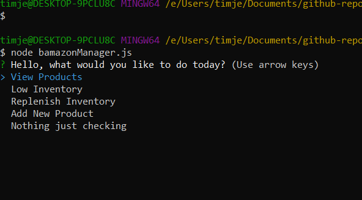
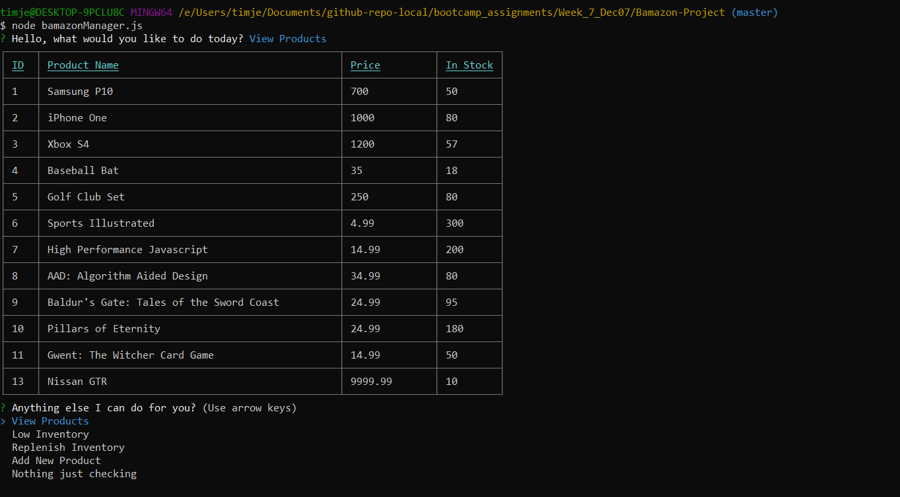
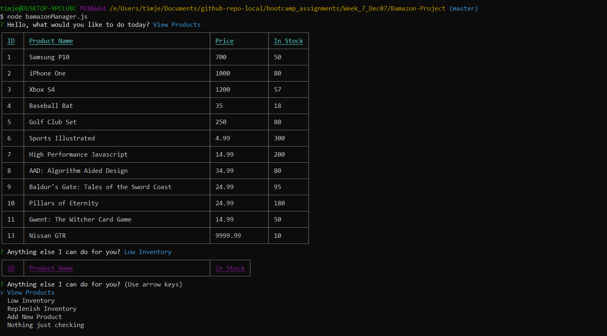
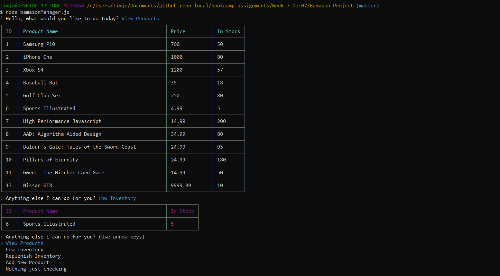
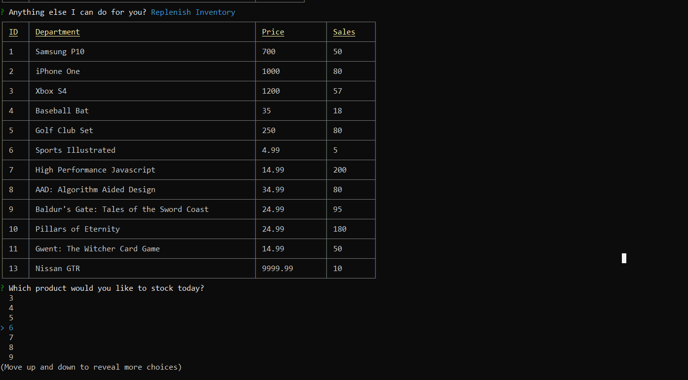
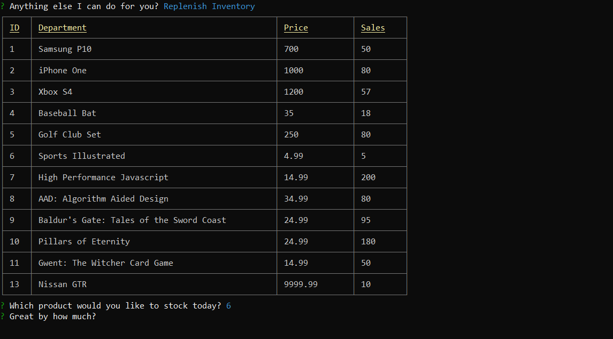
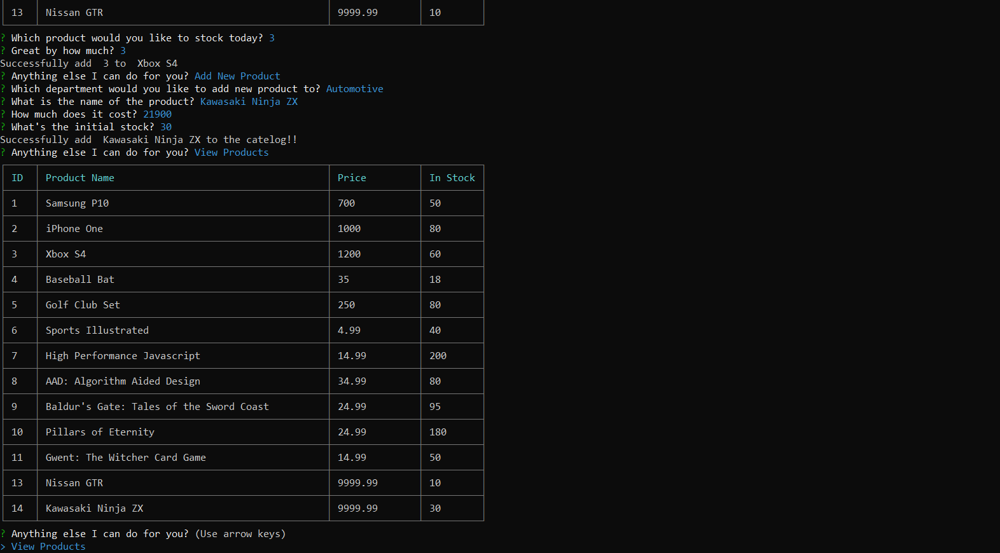

# Bamazon-Project
Working with sql and node    

## ver 1.0.0 

The Bamazon app is an interactive inferface for Bamazon(fake) to handle its day to day businesses.

#### <strong>The customer view (bamazonCustomer.js)</strong>

  
Customer are welcome with a list of available products  

  
Customer can choose from a list of product Ids to buy the product they want  

  
Once select the item they wish to purchase (in this case item 4, Baseball Bat) the customer is prompted with the question  

  
If it's successful customer will be congradulated on their purchase and ask if they want to buy something else  
> Y: The app will bring customer back to welcome page with changes reflecting the last purchase  
> N: The app will prompt customer with good bye and terminate the process  

  
If the customer attempts to buy more than the products available in store, the app will prompt the user with fail message and ask if they want to buy something else  
> Y: The app will bring customer back to welcome page with changes reflecting the last purchase  
> N: The app will prompt customer with good bye and terminate the process  

    

#### The manager view (bamazonManager.js)

  
When entering the app manager are greeted with a list of utilities available for assisting store management  

  
Choosing view products the manager will get a list of items available in store  

 
  
Alternatively the manager can also ask the app to show him a list of products that are running low  
> As shown in first image all products are above the low-inventory threshold so nothing but the table head will show  
> However, if any items in store drops below the threshold the list will be shown in the list  

  
  
The manager can use the "replenish inventory" option to stock up the store. Once choosed the item (by the id) the manager is then prompted with the amount of purchase.  

  
The manager can also add new product to the store available list. The app will then prompt with a series of question asking for the name of the product, department, price and initial inventory count (Unfortunately I set the column byte length a little too low to handle number larger than 9999)  

#### The supervisor view (bamazonManager.js)
