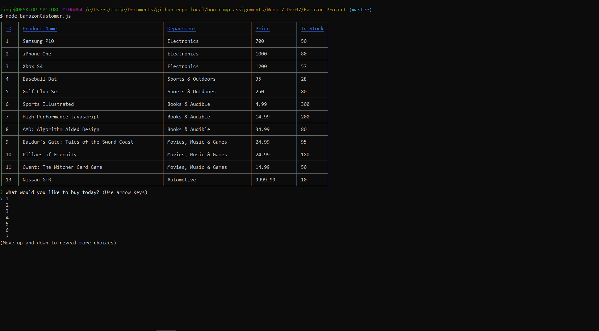
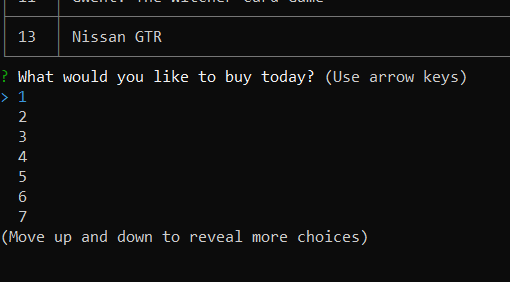
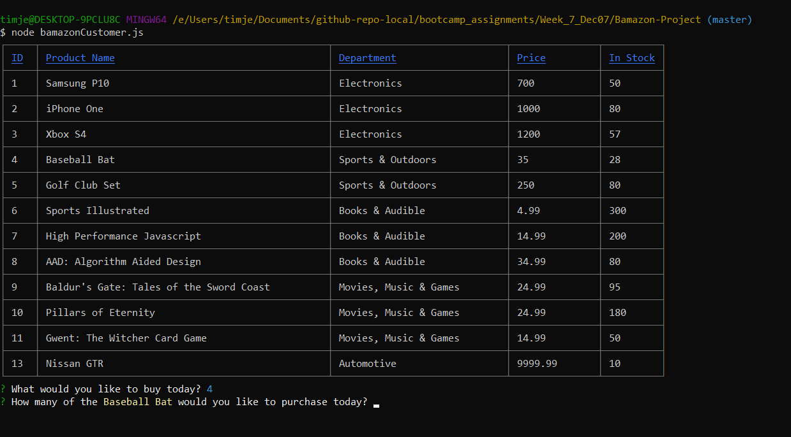
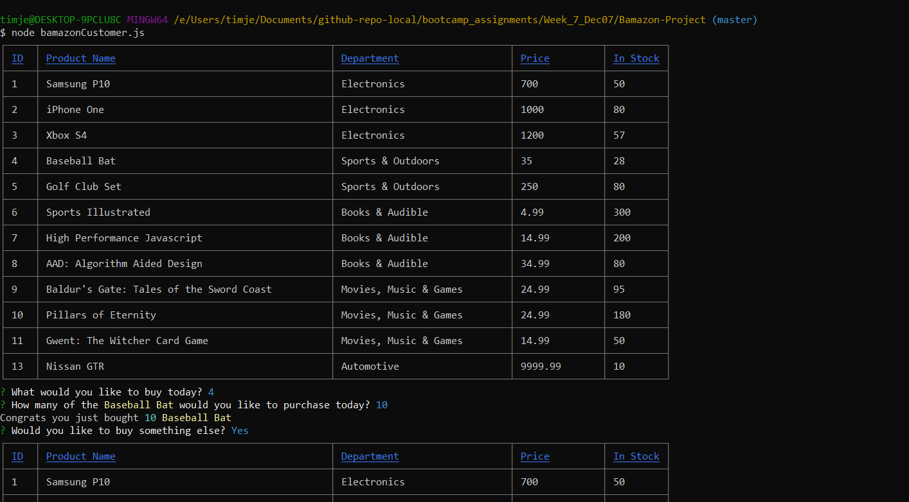
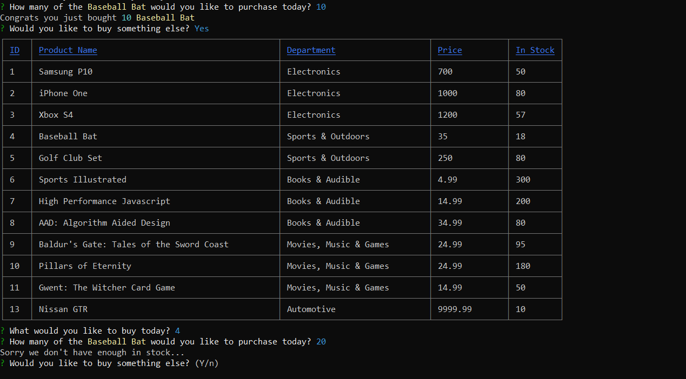
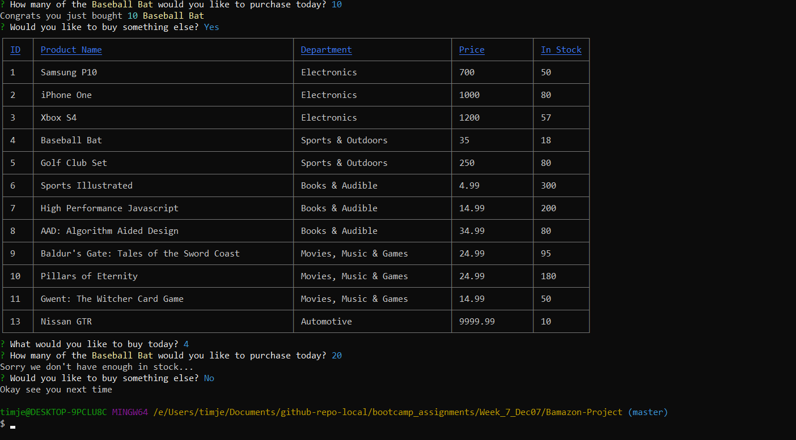

# Bamazon-Project
Working with sql and node 

## ver 1.0.0 

The Bamazon app is an interactive inferface for Bamazon(fake) to handle its day to day businesses.

##### The customer view (bamazonCustomer.js)

Customer are welcome with a list of available products

Customer can choose from a list of product Ids to buy the product they want

 
Once select the item they wish to purchase (in this case item 4, Baseball Bat) the customer is prompted with the question

If it's successful customer will be congradulated on their purchase and ask if they want to buy something else
> Y: The app will bring customer back to welcome page with changes reflecting the last purchase
> N: The app will prompt customer with good bye and terminate the process

If the customer attempts to buy more than the products available in store, the app will prompt the user with fail message and ask if they want to buy something else
> Y: The app will bring customer back to welcome page with changes reflecting the last purchase
> N: The app will prompt customer with good bye and terminate the process

##### The manager view (bamazonManager.js)